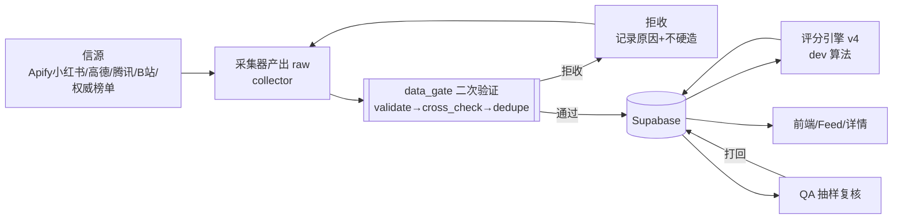
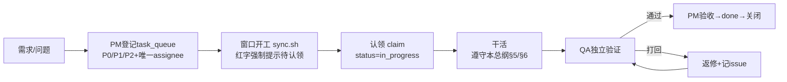
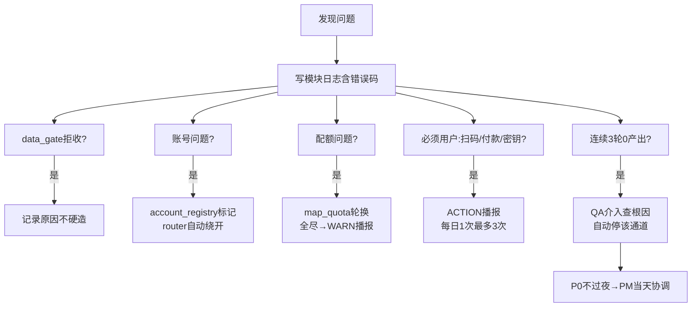

# 美食图鉴项目治理总纲 · GOVERNANCE_MASTER

> **版本**：v1.0 | **发布**：2026-10-01 | **维护者**：PM窗口（CTFS_PM）
> **性质**：本项目唯一权威总纲。目的、需求、实现方式、模块职责、工作流、验收标准全部以此为准。
> **冲突裁决**：本文档与其他文档冲突时，**以本文档为准**，并通知PM修正旧文档。
> **配套文档**：SYSTEM_ARCH.md（体系图，PM）| ROLE_WORK_SPEC.md（三组件方案，QA）| MODULES.md（模块分类，QA）| ROLE_SYNC.md（协作机制）| WINDOWS.md（会话注册表）

---

## 0. 一句话总纲

**一个目的、一条数据管线、三个公共组件、四窗口协作、一个真源（task_queue）、一套验收标准。**
任何工作不符合此总纲 = 不算完成；任何绕过公共组件的代码 = QA打回。

---

## 1. 项目目的（为什么做）

### 1.1 核心定义
**上海美食图鉴** = 一个数据驱动的"上海高端/特色美食决策工具"：
- 覆盖上海全境在营餐厅（含高端餐饮、私房菜、主厨名店）
- 每个餐厅有**真实可追溯**的：基础信息、口味评分、食客证据、主厨/招牌菜、营业状态
- 面向用户提供"值得吃、为什么值得吃、吃什么"的可信答案

### 1.2 必须满足的三个底线（历史教训，不可再犯）
| 底线 | 含义 | 违反示例（已发生） |
|------|------|-------------------|
| **真实性** | 每条入库数据可溯源、可核验 | 房产词污染frontier→采回0篇美食（Q-010）；cookie失效仍显示登录成功 |
| **无虚假通过** | 系统说"在跑"必须真的在跑、有产出 | POOL_RUNNING标记但进程已死（Q-002）；搜索限流空结果误判saturated（Q-009） |
| **一致性** | 代码/文档/数据库三者口径一致 | 迁移文件v3公式 vs 数据库v4公式（Q-003） |

### 1.3 成功标准（最终验收）
1. 数据：≥1500家在营餐厅，口味分覆盖率≥90%，电话/营业时间/菜系覆盖率≥98%
2. 真实：每条评分有食客证据链（笔记/评论可追溯），0条无来源硬标签
3. 运转：采集/评分/补全全自动，异常自动告警+自愈，无人工盯盘
4. 质量：QA红队每轮迭代挑出问题数递减，P0问题不过夜

---

## 2. 需求清单（全部需求，含用户原始诉求）

### 2.1 用户原始诉求（2026-09-28以来，全部保留）
| # | 需求 | 当前状态 |
|---|------|---------|
| R1 | 解决"代码有坑难察觉、登录虚假通过" | ✅ 已建四窗口+质量门禁 |
| R2 | 项目被监管、有人推动，立刻上手（不按周） | ✅ PM每日盘点+认领强制 |
| R3 | QA模拟多重身份残忍挑刺→汇总→用户审阅→开发迭代 | ✅ 已制度化（见§7.4） |
| R4 | 全流程标准化自动工作流 | ⏳ 本总纲落地后生效 |
| R5 | 采集问题+报错代码+解决方式，分两个md | ✅ 已交付（collector+dev各一份） |
| R6 | 多窗口协作+公共状态拉平（账号/流量/费用） | ⏳ 依赖account_registry落地 |
| R7 | sync模块可扩展接入更多窗口 | ✅ 已支持 |
| R8 | sync运行前校验：窗口对齐/环境治理/边界清晰 | ✅ 已建 |
| R9 | 提醒全挪QA：停飞书、TG唯一、柔和推送 | ✅ 已建qa_broadcast |
| R10 | 自检自巡提示+自动调度 | ✅ 19条cron |
| R11 | 修复失败序列（空转/重复/刷屏） | ✅ 已修复 |
| R12 | 8逻辑角色→4窗口分配 | ✅ 已分配 |
| R13 | 各窗口确认职责+问题负责人说明解决 | ⏳ 待QA窗口确认 |
| R14 | 服务器SSH不可达→collector负责 | ✅ 已登记Q-013 |
| R15 | **工作认领/模块合并/衔接不满意→彻查优化** | ✅ 本总纲即产出 |

### 2.2 产品功能需求（数据→功能映射）
| 功能 | 数据依赖 | 负责窗口 |
|------|---------|---------|
| 首页推荐Feed（评分Top/证据充分） | 评分+证据链 | PM定义口径 / dev实现 |
| 餐厅详情（信息/营业/电话/主厨/菜） | 基础+补全+关联 | collector采 / dev展示 |
| 菜系/区域筛选 | cuisine+districts标签 | collector采 / dev实现 |
| 主厨人物页 | chef表+关联 | collector采 / dev实现 |
| 软广识别（哪些是营销号） | softad概率 | dev算法 |
| 权威榜单对账（米其林/黑珍珠） | authority表 | collector采 / QA验证 |

---

## 3. 实现方式（技术栈与架构）

### 3.1 技术栈（已定，不更改）
| 层 | 技术 | 说明 |
|----|------|------|
| 数据库 | **Supabase**（PostgreSQL+PostgREST） | restaurant/comment/chef/hypothesis/task_queue等 |
| 服务器 | **腾讯云轻量 49.234.35.92**（ubuntu@，容器food-cloud） | 部署/cron/调度 |
| 采集 | **Apify云采集**（小红书）+ 高德/腾讯API + B站/权威榜单 | 已充值Starter $19/月 |
| 代码 | Python 3（cloud/下77个模块）+ Next.js前端（app/） | 部署：Docker+git push |
| 调度 | cron 19条（容器内） | watchdog/patrol/各fill |
| 通知 | **Telegram唯一通道**（飞书已停） | qa_broadcast整合 |
| 代理 | Clash 127.0.0.1:7897（网络被拦时用） | 本机到腾讯云路径异常时 |

### 3.2 数据模型（核心表，dev维护schema）
| 表 | 关键字段 | 写入方 | 说明 |
|----|---------|--------|------|
| restaurant | name/address/lng/lat/cuisine/status/phone/hours | data_gate.admit | 主表 |
| comment/review | restaurant_id/source/review_kind/trust_level/content | data_gate.admit | 评价证据 |
| chef | name/restaurant_id/evidence | data_gate.admit | 主厨 |
| lead_hypotheses | is_seed/status/confidence/source | collector | 未证实候选池 |
| task_queue | title/assignee/status/priority/issue_id | 全员 | **唯一真源** |
| authority_sync | 米其林/黑珍珠对账 | collector | 榜单 |

### 3.3 公共组件（三件套，**dev必须在2026-10-02前交付骨架**）
> 这是根治"各自为战"的钥匙。三组件是**唯一入口**，任何绕过=QA打回。

| 组件 | 文件 | 核心API | 解决的病 |
|------|------|---------|---------|
| **account_registry** | cloud/account_registry.py | list/probe/status/mark/pick/summary | 账号11处各自认定（Q-001类） |
| **common_core** | cloud/common_core.py | req/config/notify/log | health被13处import无规范 |
| **data_gate** | cloud/data_gate.py | validate/cross_check/dedupe/admit/report | 采集数据无二次验证（Q-004类） |

**硬约束**：
1. 账号状态只经account_registry读写（状态文件独占写）
2. 新代码的请求/配置/通知/日志必须走common_core
3. 所有采集器入库前必须过data_gate，违反的PR不合并

---

## 4. 流程图（四条主流程）

### 4.1 数据流（数据怎么进来、怎么变可信）★核心

**要点**：任何数据必须过闸；被拒数据必须留原因可追溯；评分必须有证据链支撑。

### 4.2 任务流（谁干活、怎么验收）


### 4.3 问题升级流（遇到问题找谁、多快解决）


### 4.4 部署流（代码怎么上服务器）
```
dev/collector 本地改 → git commit+push
  → 服务器 food-cloud 容器 git pull（或 build_on_server.sh）
  → 重启受影响进程/cron
  → 验证：跑一次真实入口（非"应该好了"）
  → sync.sh push "说明" 留痕
```
**铁律**：部署必验证；"应该好了"不算完成。

---

## 5. 模块及组件功能（谁拥有什么）

### 5.1 四层模块分类（MODULES.md，QA维护，共77个.py）
| 层 | 内容 | 数量 | 责任人 | 规则 |
|----|------|------|--------|------|
| **L1 调度层** | cloud_router/gap_pool/各fill/broadcast/watchdog… | 19+4 | collector/qa | 不动，只允许修bug |
| **L2 服务层** | health/notifier/map_helpers/map_quota/account_repair… | ~12 | dev | **逐步迁三组件**，迁移清单dev列出 |
| **L3 一次性/诊断** | _diag_tree/_inspect_pool/_stop_pool/fix_paths | 4 | dev | 移archive/（已开始） |
| **L4 待合并** | review_apify+review_ugc→review_fill等8组 | ~8 | dev | 合并必带dry-run回归对比 |

**合并铁律**：dry-run基线 → 合并 → dry-run对比 → 差异=0才commit → 跑真实cron确认。

### 5.2 窗口职责边界（不可越界）
| 窗口 | 拥有 | 不做什么 |
|------|------|---------|
| **PM**（本窗口） | 方向/优先级/任务分配/验收口径/体系图/推动 | 不写业务代码/不采数据/不审代码细节 |
| **QA**（原PM窗口） | 质量审计/release_audit A–H/红队/台账/播报/回归 | 不写业务功能/不替用户操作/不做产品决策 |
| **dev**（CTFS_数据库及架构工程师） | 代码/组件/部署/schema/算法/前端(冻结) | 不碰账号cookie/不决定采集策略/不改采集数据 |
| **collector**（CTFS_爬虫工程师） | 信源/采集/解析/账号运维/数据补全/SOP | 不改前端/不修业务bug/不写评分算法 |
| **用户** | 付款/扫码/密钥/拍板 | — |

### 5.3 采集通道清单（COLLECTION_SOP.md，collector交付）
| 通道 | 采什么 | 调度 | 依赖组件 | 问题处理 |
|------|--------|------|---------|---------|
| XHS-Apify | 笔记/评论（主力） | apify_collect.py | data_gate | Token失效→ACTION用户 |
| 高德 | 电话/营业时间/评分/坐标 | cron :15/:35/:55 | map_quota+data_gate | key配额→轮换 |
| 腾讯 | 电话/坐标 | cloud_phone_fill | map_quota | 日配额→凌晨重置 |
| B站 | 探店 | cron 6h | data_gate | 配额→退避 |
| 权威榜单 | 米其林/黑珍珠对账 | cron+router | data_gate | 缺店→留队列取证 |
| KOL跨平台 | 美食作家 | cron 6h | data_gate | 无key→降级 |

**采集数据规范**（违反进不了data_gate）：
- 餐厅必填：name/address/lng/lat/cuisine/status
- 评论必填：restaurant_id/source_platform/review_kind/trust_level/content
- 枚举：review_kind(diner|platform_aggregate|kol|media)、trust_level(high|mid|low)
- 硬标签（连锁/预制/中央厨房）必须有证据URL，否则不上

---

## 6. 开发工作流（dev/collector写代码的规范）

### 6.1 代码提交规范
1. **一个任务一个commit**，commit信息 = `类型: 说明（关联task #id）`
2. 新代码**必须**走三组件（account_registry/common_core/data_gate）
3. 全表查询**必须**分页（fetch_all，禁止select * 大表，Q-008教训）
4. 采集器入库**必须**过data_gate；被拒数据留原因
5. 删除/合并模块**必须**先dry-run回归对比，差异=0才提交

### 6.2 工作节奏（不按周，按天）
| 时间 | dev/collector动作 |
|------|-------------------|
| 开工 | bash sync.sh <角色> → 读STATUS → 认领todo任务 |
| 工作中 | 完成任务→sync.sh push → QA验证 |
| 卡住 | 写STATUS原因+找PM协调 |
| P0 | 不过夜，当天修完+验证 |

### 6.3 当前迭代待办（PM排期，2026-10-01）
| # | 任务 | 责任人 | 优先级 | 状态 |
|---|------|--------|--------|------|
| 1 | Apify采集跑起来（已充值Starter） | collector | P0 | todo（解除blocked） |
| 15 | apify_collect.py实现 | dev | P0 | todo |
| 11 | account_registry.py | dev | P0 | todo |
| 12 | common_core.py | dev | P0 | todo |
| 13 | data_gate.py | dev | P0 | todo |
| 14 | COLLECTION_SOP.md | collector | P1 | todo |
| R28 | CHECK D/G单店字段修复 | collector | P1 | todo |
| R29 | CHECK A网格覆盖修复 | collector | P1 | todo |
| 9 | 服务器SSH恢复 | collector | P0 | in_progress |

---

## 7. 验收标准（怎么算"完成"）

### 7.1 任务验收通用标准（QA执行复核，PM最终拍板）
一个任务算完成，必须**同时**满足：
1. **功能达成**：任务描述的全部要点已实现
2. **过组件**：相关代码走三组件，无绕过
3. **已部署**：代码在服务器真实环境生效（非本地）
4. **已验证**：跑过真实入口，有验证证据（日志/输出/数据变化）
5. **已留痕**：task_queue状态done + git commit + STATUS更新

### 7.2 release_audit A–H（QA每轮迭代必跑，完整清单）
| 项 | 检查内容 | 通过标准 |
|----|---------|---------|
| A | 数据完整性 | 必填字段0缺失，覆盖率达标 |
| B | 评分一致性 | 数据库公式=迁移文件=代码，0家不符 |
| C | 采集有效性 | 无虚假通过：有产出才算在跑 |
| D | 单店字段 | 电话/营业时间/菜系无空（比例达标） |
| E | 证据链 | 评分有食客证据，硬标签有URL |
| F | 回归 | 修A不坏B，抽样对比通过 |
| G | 覆盖率网格 | 菜系/区域网格无漏 |
| H | 真实渲染 | 前端页面实际渲染验收（恢复后） |

### 7.3 红队测试标准（QA每轮迭代执行）
模拟身份：普通用户 / 美食专家评委 / 博主 / 餐饮从业者 / 厨师老板本人 / 竞对
角度：体验感 / 真实性 / 可靠性 / 合规性 / 鲁棒性
产出：负面清单 → 用户审阅 → PM排期 → dev/collector修复 → QA复验
**规则**：不奉承、不找补、以搞垮产品为目的挑刺。

### 7.4 组件验收
| 组件 | 验收方式 |
|------|---------|
| account_registry | 11个调用方迁移完，无重复探测；QA验证无绕过 |
| common_core | 新代码100%走core；存量迁移清单完成 |
| data_gate | 所有采集器接入；QA抽样验证拒收率报告合理 |

---

## 8. 立即落地（今天起执行）

1. **PM（我）**：本文档push + 通知四窗口按此执行
2. **collector**：解除#1阻塞 → Apify采集跑起来 → 交付COLLECTION_SOP.md
3. **dev**：按#11/#12/#13实现三组件骨架（2026-10-02前）→ #15 apify_collect.py
4. **QA**：确认任命 → 跑release_audit A–H当日总结 → 验收SYSTEM_ARCH+本总纲
5. **用户**：只需处理扫码（方舟）/重大拍板，其余全自动

---

## 9. 常见问题速查（遇到问题找谁）

| 问题 | 找谁 |
|------|------|
| 采集异常/账号/配额/数据补全 | collector（CTFS_爬虫工程师） |
| 代码bug/组件实现/schema/算法 | dev（CTFS_数据库及架构工程师） |
| 质量验收/红队/播报/回归 | QA（CTFS_PM窗口） |
| 任务分配/优先级/跨窗口协调 | PM（CTFS_PM，本窗口） |
| 付款/扫码/密钥/重大决策 | 用户（唯一拍板） |
| 服务器/部署/cron异常 | collector（部署）+ dev（代码） |
