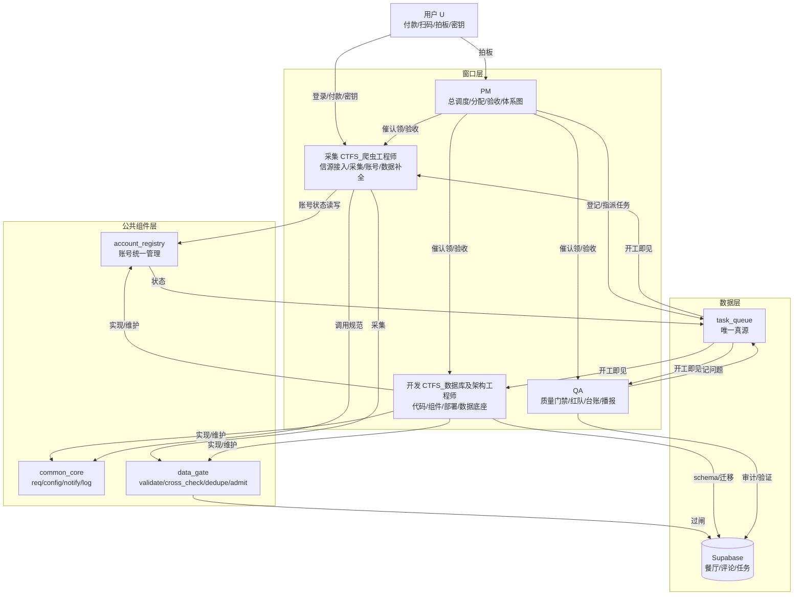

# 运作体系总图 · SYSTEM_ARCH

> 发布：2026-10-01 | PM窗口 | 验收标准：新窗口读后5分钟能说清"谁负责什么、数据怎么流、遇到问题找谁"
> 配套：role-task-allocation.md（角色分配）| ROLE_WORK_SPEC.md（三组件方案）| MODULES.md（模块分类）| WINDOWS.md（会话注册表）| ROLE_SYNC.md（协作机制）

---

## 一、一句话体系

**四窗口 + 三层组件 + 一个真源**：采集/dev产出数据，经 data_gate 验证入库，QA 把关质量，PM 调度推进；所有状态以 task_queue 为真源，所有窗口开工读 sync.sh、结束 push。

---

## 二、角色→职责→数据流 全图（Mermaid）



---

## 三、三大公共组件（dev实现，PM评审）

| 组件 | 解决什么 | 核心API | 唯一入口约束 |
|------|---------|---------|-------------|
| **account_registry.py** | 账号"四处认定"（11模块各自判） | list / probe / status / mark / pick / summary | 账号状态只经它读写，状态文件它独占写 |
| **common_core.py** | 调用各自为政（health被13处import无规范） | req / config / notify / log | 新代码必须走core，告警/请求/日志收敛 |
| **data_gate.py** | 采集数据无二次验证 | validate / cross_check / dedupe / admit / report | 所有采集器入库前必须过闸 |

**硬约束**：三组件是唯一入口，绕过自写判定的代码 QA 打回。

---

## 四、三条主流程

### 流程1：任务流转（谁干活）
```
需求/问题 → PM登记 task_queue（P0/P1/P2，指派窗口）
  → 窗口开工 bash sync.sh <角色> → 红字提示待认领
  → 窗口认领（task_helper.py claim <id>）→ in_progress
  → 窗口完成（done <id>）→ QA 独立验证
  → 验证通过 → PM 验收 → 关闭
  → 验证不通过 → 打回 + 记 issue → 重新修
```

### 流程2：问题升级（遇到问题找谁）
```
采集异常 → 写模块日志（含错误码）
  → data_gate 拒收 → 记录原因，不硬造数据
  → 账号问题 → account_registry 标记 → router 自动绕开
  → 配额问题 → map_quota 自动轮换 → 全尽 → WARN 播报
  → 必须用户（扫码/付款/密钥）→ ACTION 播报（每日1次最多3次）
  → 连续3轮0产出 → 自动停该通道 + QA 介入查根因
  → P0 不过夜 → PM 当天协调
```

### 流程3：数据入库（数据怎么流）
```
采集器产出 raw 记录
  → data_gate.validate（必填/类型/枚举/长度）
  → data_gate.cross_check（跨源互验：电话 高德vs点评；坐标合理性）
  → data_gate.dedupe（指纹去重：标题+地址hash）
  → data_gate.admit → 写库（restaurant/review/…）
  → data_gate.report（拒收率/原因分布 → QA 周检）
  → 硬标签（连锁/预制/中央厨房）必须有证据URL，否则不上硬标签
```

---

## 五、数据底座与调度

| 层 | 内容 | 责任人 |
|----|------|--------|
| 数据库 | Supabase（restaurant/comment/hypothesis/task_queue等） | dev 维护 schema |
| 容器 | 腾讯云 food-cloud（cron 19+4 调度任务） | collector 部署/运行 |
| 调度 | L1调度层：cloud_router/gap_pool/各cloud_*_fill（见 MODULES.md） | collector |
| 服务层 | L2公共库：health/notifier/map_helpers/xhs_cookie_pool（12个，逐步迁移三组件） | dev |
| 一次性 | L3归档：_diag_tree/_inspect_pool/_stop_pool/fix_paths | dev 移 archive/ |
| 待合并 | L4：review_apify_fill+review_ugc_fill→review_fill 等8组 | dev（先dry-run基线→合并→对比） |

---

## 六、当前真实状态（2026-10-01，PM直读各窗口会话）

| 窗口 | 正在做 | 完成 | 卡点 |
|------|--------|------|------|
| 采集 | 舰队v2每日catchup、LLM key方舟登录流程 | 事实证据机制(18品牌/26店/缺口=0)、密钥注入工具、Q-013根因查明 | 方舟登录(等你扫码)、Apify额度$0、新地图key |
| 开发 | findings全量扫描(12片1476家)、三段式cron、美食家简介45/132 | 搜索引擎校准B方案(360主力)、停用agent版cron | 无（等全量扫描结果） |
| QA(原PM) | 刚收到互换任命，待开工 | — | 待确认任命 |
| PM(本窗口) | 体系总图（本文档） | 队列对齐、Q-013定位 | — |

---

## 七、遇到问题找谁（速查）

| 问题 | 找谁 |
|------|------|
| 数据采集异常/账号问题/配额 | 采集窗口（CTFS_爬虫工程师） |
| 代码bug/组件实现/schema变更 | 开发窗口（CTFS_数据库及架构工程师） |
| 质量问题/验收/红队/播报 | QA窗口（CTFS_PM） |
| 任务分配/优先级/跨窗口协调/进度 | PM窗口（CTFS_QA，本窗口） |
| 付款/扫码/密钥/重大决策 | 用户（唯一拍板人） |
