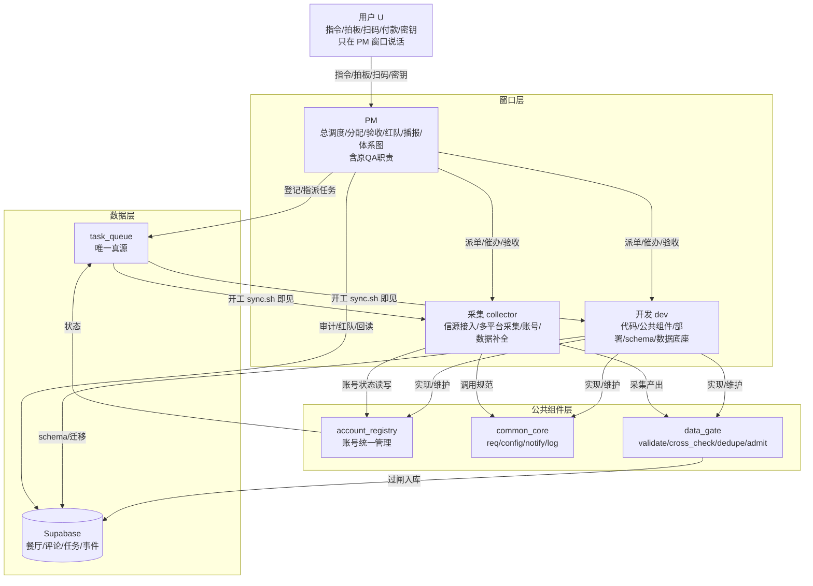

# 运作体系总图 · SYSTEM_ARCH

> 发布：2026-10-01（v2 按方案B统一） | PM窗口 | **方案B：四窗口→三窗口，QA 职责并入 PM**
> 验收标准：新窗口读后 5 分钟能说清“谁负责什么、数据怎么流、遇到问题找谁”
> 配套：role-task-allocation.md（角色分配）| ROLE_WORK_SPEC.md（三组件方案）| MODULES.md（模块分类）| WINDOWS.md（会话注册表）| ROLE_SYNC.md（协作机制）| GOVERNANCE_MASTER.md（唯一权威总纲）

---

## 一、一句话体系

**三窗口 + 三层组件 + 一个真源**：采集 / 开发产出数据，经 data_gate 验证入库；PM 统一调度并承担验收与红队（原 QA 职责）；**用户只在 PM 窗口说话**。所有任务状态以 task_queue 为唯一真源，三窗口开工必读 `sync.sh`（统一状态卡）、结束 push。

三个窗口：
- **PM**：调度中枢 + 质量门禁（任务分配 / 优先级 / 验收 / 红队 / 播报 / 体系总图）。
- **采集（collector）**：信源接入、多平台采集、账号维护、数据补全、采集 SOP、LLM 舰队 / 探针。
- **开发（dev）**：代码、公共组件、部署、schema / 迁移、算法、前端（当前冻结）。

---

## 二、角色→职责→数据流 全图（Mermaid）



> 方案B 已删除独立 QA 节点：质量门禁、红队、回归、问题台账全部由 **PM 在发版节点执行**；原 QA 窗口停用。

---

## 三、三大公共组件（dev 实现，PM 评审验收）

| 组件 | 解决什么 | 核心 API | 唯一入口约束 |
|------|---------|---------|-------------|
| **account_registry.py** | 账号“四处认定”（多模块各自判） | list / probe / status / mark / pick / summary | 账号状态只经它读写，状态文件由它独占写 |
| **common_core.py** | 调用各自为政（health 被多处 import 无规范） | req / config / notify / log | 新代码必须走 core，告警 / 请求 / 日志收敛 |
| **data_gate.py** | 采集数据无二次验证 | validate / cross_check / dedupe / admit / report | 所有采集器入库前必须过闸 |

**硬约束**：三组件是唯一入口，绕过自写判定的代码，PM 验收打回。

---

## 四、三条主流程

### 流程1：任务流转（谁干活）
```
需求/问题 → PM 登记 task_queue（P0/P1/P2，唯一 assignee）
  → 执行窗口开工 bash sync.sh <collector|dev> → 红字提示待认领
  → 窗口认领（task_helper.py claim <id>）→ in_progress
  → 窗口完成（done <id>）→ sync.sh push
  → PM 独立验证 / 红队复核
  → 验证通过 → PM 验收关闭
  → 验证不通过 → PM 打回 + 记 issue → 重新修
```

### 流程2：问题升级（遇到问题找谁）
```
采集异常 → 写模块日志（含错误码）
  → data_gate 拒收 → 记录原因，不硬造数据
  → 账号问题 → account_registry 标记 → router 自动绕开
  → 配额问题 → map_quota 自动轮换（多 key/多出口）→ 全尽 → WARN 播报
  → 必须用户（扫码/付款/密钥）→ PM 发 ACTION 播报（有界提醒，不刷屏）
  → 连续 3 轮 0 产出 → 自动停该通道 + PM 介入查根因
  → P0 不过夜 → PM 当天协调
```

### 流程3：数据入库（数据怎么流）
```
采集器产出 raw 记录
  → data_gate.validate（必填/类型/枚举/长度）
  → data_gate.cross_check（跨源互验：电话 高德 vs 点评；坐标合理性）
  → data_gate.dedupe（指纹去重：名称归一 + 地址 hash）
  → data_gate.admit → 写库（restaurant / review / …）
  → data_gate.report（拒收率/原因分布 → PM 发版节点检查）
  → 硬标签（连锁/预制/中央厨房）必须带证据 URL，否则不上硬标签
```

---

## 五、数据底座与调度

| 层 | 内容 | 责任人 |
|----|------|--------|
| 数据库 | Supabase（restaurants / reviews / chefs / groups / events / task_queue 等） | dev 维护 schema，PM 回读审计 |
| 主容器 | 腾讯云 food-cloud（上海 Lighthouse，cron 调度 reconcile/采集/补全） | collector 部署 / 运行 |
| 外部自愈 | 广州代理盒入站看门狗：TCP 探针 + food 公网失联自动 Stop/Start（cloud/external_watchdog/） | collector 维护 |
| 主动调度 | cloud/pm_dispatch.py（每 15 分钟扫 task_queue，超 SLA 未认领自动 TG+飞书唤醒） | PM |
| 采集 / 调度 | cloud_router / gap_pool / 各 cloud_*_collect·fill（见 MODULES.md） | collector |
| 公共服务库 | health / notifier / map_helpers / map_quota 等（逐步迁移三组件） | dev |
| 一次性 / 归档 | _diag / _inspect / fix_* 等 | dev 移 archive/ |

---

## 六、当前真实状态（2026-10-01，以 task_queue / DB 回读为准）

| 窗口 | 正在做 | 已完成 | 卡点 |
|------|--------|--------|------|
| PM（本窗口） | 体系总图（本文档，方案B统一）；三窗口调度 | 三窗口收敛、GOVERNANCE_MASTER、三份地基规范、pm_dispatch 主动唤醒、外部看门狗上线 | 三组件尚未落地（待 dev） |
| 采集 collector | Apify 小红书采集恢复、LLM 舰队每日 catchup | 事实证据机制、Apify 通道（Starter 已生效）、采集脚本与预算闸门 | 多账号 / 独立实名地图 key 扩容；部分漏店取证 |
| 开发 dev | findings 全量扫描、连锁/集团/改价落库、三段式 cron | reconcile 统一编排、搜索引擎校准、先验/证据分离迁移 | 三组件 #11/#12/#13（P0）待开工；前端冻结 |

> 计数一律以 DB 现读为唯一权威，本表仅作态势概览，不作计数依据。

---

## 七、遇到问题找谁（速查）

| 问题 | 找谁 |
|------|------|
| 任务分配 / 优先级 / 跨窗口协调 / 进度 / 验收 / 红队 / 播报 | **PM 窗口**（唯一调度中枢，含原 QA 职责） |
| 数据采集异常 / 账号 / 配额 / 信源接入 / 数据补全 | 采集窗口（collector） |
| 代码 bug / 公共组件 / 部署 / schema 变更 / 算法 | 开发窗口（dev） |
| 付款 / 扫码 / 密钥 / 重大决策 | 用户（唯一拍板人，只在 PM 窗口交互） |
