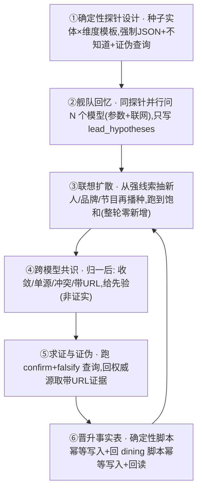

# LLM 知识源舰队（LLM Sourcing Fleet）— 以国产大模型为源补事实、建关系网、求证的通用方案

> 解决「纯采集/关键词爬虫」的天花板：师承沿革、集团关系、招牌菜、榜单/节目成员、
> 关店迁址等事实，靠关键词很难捞全，但存在于大模型的参数记忆与联网检索结果里。
> 本方案把**豆包、Kimi、DeepSeek、混元、Qwen、GLM、MiniMax 等国产大模型本身作为知识源**，
> 模型负责「回忆 + 联想 + 初步取证」，确定性脚本负责「共识聚合 + 门槛 + 晋升」，权威源负责「求证/证伪」。
> 与 HAE（hae_engine）配套：本文件是 HAE `--diverge-llm` 的多模型通用化总纲。

## 0. 最高认识论原则（不可违反）

1. **模型是线索生成器与联想记忆，不是权威**：任何模型输出【绝不直写事实表】，只进隔离表 `lead_hypotheses`。
2. **多模型一致 ≠ 独立证实**：国产模型训练语料高度重叠，一致只是「先验」（可能同源），晋升仍需外部权威 URL。
3. **每条假设必带强制证伪查询（falsify_queries）**，不只找支持证据。
4. **宁空不假**：模型自标 知道 / 推断 / 不知道；无记忆留空，禁止编造时间、人名、年份。
5. **假设与事实物理/权限隔离**：lead_hypotheses 对 anon/authenticated 不可见，不进前端。
6. **确定性优先**：实体归一、查重、共识计数、门槛、晋升全部脚本化；模型只做语义回忆与判断。

## 1. 模型舰队分层（先认清每个模型能做什么）

| 角色 | 模型（国产主流） | 能力 | 在管线中的用途 |
|---|---|---|---|
| **联网取证型**（带 URL，最有价值） | 豆包、Kimi、DeepSeek(联网)、通义 Qwen、混元、GLM、MiniMax（开启联网搜索） | 参数回忆 + 实时网页检索 + 返回来源 URL | 既产出线索，又取回可溯源证据页 |
| **参数回忆型**（无 URL） | 同上模型的纯参数 API（关联网） | 知识截止前的稳定事实，无时效 | 跨模型互证稳定事实、扩召回；不单独支撑时效事实 |
| 接入方式 | 火山方舟 ARK（托管豆包/DeepSeek，OpenAI 兼容）、Moonshot（Kimi）、DashScope 兼容模式（Qwen）、智谱（GLM）、MiniMax、混元 | 多为 OpenAI 兼容 REST；联网搜索为各家工具/插件 | 24/7 自动化优先走 API；网页对话(需登录)仅作兜底 |

> 各适配器统一封装：base_url / api_key / model_id / 是否支持联网搜索 / 搜索工具调用语法。
> Key 只写 gitignored `deploy.env`；缺 key 的适配器自动跳过、不报错。

## 2. 通用闭环（模型无关）：探针 → 舰队回忆 → 联想扩散 → 共识 → 求证/证伪 → 晋升 → 再播种



### ① 确定性探针设计（种子 × 维度）
对每类种子实体用固定探针模板，强制结构化 JSON 返回：
- **chef 主厨**：师承/师父师爷、从业沿革(年份+店名)、招牌菜、荣誉(榜单/节目届期)、现任/曾任店、关联主厨；
- **owner 老板**：创业沿革、旗下品牌/门店、合伙人与合作主厨、疑似关联品牌、工商主体；
- **restaurant 店**：主厨/主理人、所属集团、菜系定位、招牌菜、开业/关店/迁址、同名分店；
- **blogger 美食家/博主**：身份、代表探店、与品牌关系、是否软广；
- **list 榜单/节目**：届期、全部成员(主厨+餐厅)、评审、由成员扩散。
每条 claim 字段：`claim_text / confidence / known_vs_inferred / source_url(联网才有) / confirm_queries[] / falsify_queries[]`，不知道就显式 null。

### ② 舰队回忆（并行撒网）
同一探针并行发给所有可用模型；输出只 upsert 进 lead_hypotheses（hid 幂等），
`proposed_by` 记录 模型+版本+日期；联网模型优先，要求附来源 URL。

### ③ 联想扩散（滚雪球建关系网）
从强/已证实线索抽取新实体（节目里的主厨、集团旗下品牌、师承同门、同店关联人），
作为新种子回到①，多轮迭代到**饱和**（连续一轮无新实体）。
由此自动长出关系图：chef↔restaurant↔group↔dish↔list↔blogger。

### ④ 跨模型共识（确定性聚合，给先验）
实体/主张归一后分类：
- **convergent 收敛**：≥2 个模型主张一致 → 先验升高；
- **single-source 单源**：仅 1 个模型 → 先验低，必须外部取证；
- **conflicting 冲突**：模型互相矛盾（如创立年份 2002 vs 2010）→ 必须外部仲裁，未决留 unverified；
- 带 URL 的联网证据优先于纯参数回忆。
注意：共识只决定「先去求证谁」，不直接等于真。

### ⑤ 求证与证伪（回到权威源）
对每条假设同时跑 confirm_queries 与 falsify_queries，证据源：
官方榜单（米其林 sitemap / 黑珍珠）、工商企查查、官网/官方公众号、新闻稿、地图 POI、真实食客 UGC。
- 联网模型可代为检索并返回 URL + 摘要；但晋升要求**落到具体来源 URL 且页内含该事实**；
- 关系/师承类需具名来源；关店/迁址按 closed_watch 三要素；
- 被证伪 → contradicted 留痕（如明路川 2023 停业）。

### ⑥ 晋升事实表（确定性、幂等、回读）
已证实事实由管线脚本（非模型）晋升：chefs / restaurants / groups / 各类关系 / awards，
带 source_url、check-first、复合主键幂等、写后回读。**新晋升实体再成为种子回到③**，图持续扩张。

## 3. 一个最小走查（以主厨为种子）

种子：主厨「杜国金」
- ②舰队回忆：豆包(联网)「厦门华尔道夫·鲜承主厨，2025/26 米其林一星」+URL；Kimi(联网)同+新闻URL；
  DeepSeek(参数)同名无URL；Qwen/GLM 部分。
- ④共识：3 模型收敛于「现任鲜承 + 一星」，其中 2 条带 URL → 强先验；但 works_at 关系仍需权威 URL。
- ⑤求证：取米其林官方页（一星·鲜承）+ 酒店官方页 → confirmed，附 2 个 source_url。
- ⑥晋升：锚定/新建主厨杜国金，link worked_at→鲜承（厦门=外地源市场，标记 origin_market；
  若将来上海开店则首页 feed 自动标记「海外/外地名店入沪」）。
- ③再播种：同节目其余主厨（赵勇、Alan Yu…）成为新种子，循环。

## 4. 落地到本仓库 / 容器

- 把 hae_engine 的单 provider `--diverge-llm` 升级为**多 provider 注册表**（model_providers）：
  ARK（豆包+DeepSeek）、Moonshot（Kimi）、DashScope（Qwen）、智谱（GLM）、MiniMax、混元；
  统一 OpenAI 兼容调用 + 各适配器联网搜索工具。
- 模式：`--fleet-recall`（探针并行→假设）、`--prove`（confirm/falsify→带URL证据）、
  `--promote-plan/--apply`（确定性晋升）。
- 无 key 时降级为 agent 自身推理（零成本）+ 跳过缺适配器；有 key 即 24/7 自动跑。
- cron：种子队列 fleet-recall → prove → promote；看门狗管 key/配额；仅 ACTION 推 TG/飞书。

## 5. 配置（deploy.env，值勿入库）

```
ARK_BASE_URL / ARK_API_KEY / HAE_MODELS_ARK=doubao-id,deepseek-id   # 火山：豆包+DeepSeek
KIMI_BASE_URL / KIMI_API_KEY / HAE_MODELS_KIMI=moonshot-...
QWEN_BASE_URL / QWEN_API_KEY / HAE_MODELS_QWEN=qwen-...
GLM_BASE_URL / GLM_API_KEY / HAE_MODELS_GLM=glm-...
MINIMAX_BASE_URL / MINIMAX_API_KEY / HAE_MODELS_MINIMAX=...
HUNYUAN_BASE_URL / HUNYUAN_API_KEY / HAE_MODELS_HUNYUAN=...
HAE_WEB_SEARCH=1     # 各适配器启用联网搜索、强制回传 URL
```

## 6. 验收 DoD

- 同一探针在 ≥2 个国产模型上跑通，结果归一进 lead_hypotheses，模型/版本/日期可追溯；
- 关系网由模型联想自动扩张，且每个新实体可指出「由哪个种子/哪条假设扩散而来」；
- 晋升事实 100% 带权威 source_url；纯参数一致但无 URL 的不晋升；冲突项留 unverified、不硬写；
- 全流程模型不直写事实表；证伪留痕；宁空不假；脚本幂等、写后回读。
