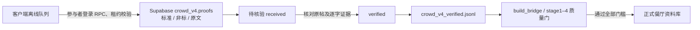

# 数据回收位置与核验边界

2026-10-07 已部署参与接入服务 `crowd-access` 到现有 Supabase 项目 `bdwrhshgdeghgyzwpxnl`。网站不需要 Supabase 管理员密钥，发布者通过独立私有管理口令查看数据。该口令不交给参与者。

| 数据 | 持久位置 | 内容与用途 |
| --- | --- | --- |
| 原始回传 | `crowd_v4.proofs.record`，PostgreSQL JSONB | `standard` 标准字段、`extra` 非标字段、`evidence` 原文及解析来源完整保留 |
| 标准字段 | `record.standard` | 平台、笔记 ID、原帖 URL、标题、发布时间、采集时间、公开作者昵称、赞/收藏/评论数；未知值保留 null |
| 非标字段 | `record.extra` | 标签、逐字意见等解析内容及扩展字段；不转成虚构评分 |
| 原文证据 | `record.evidence` | 可见正文、原文长度、截断标记、解析版本、`rendered_public_dom` 来源 |
| 去重和收件回执 | `crowd_v4.proofs.note_id` / `crowd_v4.receipts` | 笔记全局去重；断网重传沿用相同请求 UUID，返回相同回执 |
| 任务与租约 | `crowd_v4.tasks` | 店铺关联、关键词、领取状态、租约、目标条数 |
| 核验状态 | `crowd_v4.proofs` 的 status / verified_quote / source_checked_at | 新记录为 received；核验原帖、逐字引文及质量门后才为 verified；不符合的为 rejected |
| 研究补贴账本 | `crowd_v4.rewards` | 每 100 条核验有效且去重的笔记记 10 分，独立于实际付款 |

主副本是数据库，不在 Vercel 临时文件系统。公开 key 不能直接读取这些私有表；数据查看和导出需要发布身份。管理页 `/crowd/admin` 的“数据回收”可查看前 100 条待核验记录、分页下载已核验证据。无发布身份返回 403。原始记录始终保留在数据库，即使尚未核验或未进入餐厅资料库。

部署流水线的第二份证据文件路径是 `/app/data/coverage/crowd_v4_verified.jsonl`，由 `cloud/crowd_v4.py cycle --apply` 幂等导出，`build_bridge.py` 读取同名文件。这个流水线定时开关仍为 `CROWD_V4_ENABLED=0`：当前没有接通运行它的生产 Docker 环境，不能声称已自动入库。文件导出不代替数据库；网页下载是第三份副本，落在发布者浏览器的下载目录。

本工作区已实际运行导出，文件在私有 `.crowd-launch/recovery/crowd_v4_verified.jsonl`；实际为 0 条，未塞入模拟笔记。数据库已发布三条真实店铺试点任务，每家目标两条；参与者和回传记录仍为 0。设备验收、原帖核验和生产流水线启用后才可宣称完整采集入库闭环运行。

回收接口由 `crowd-access` 的 `operations` 支持限定的 publish/review/list/export；不接受任意 RPC、付款或账号管理。参与接入通过有效邀请与预留安装身份验证。安装清单只从经现有产物/源码/设备验收的私有发布清单读取，不把构建通过当作实机通过。
