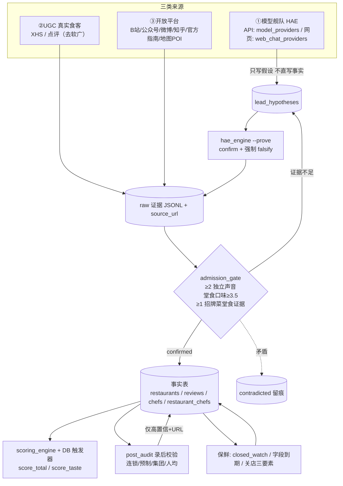
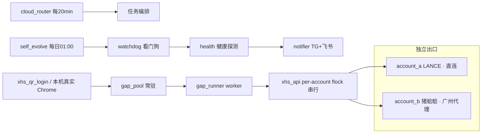

# 全体系系统图（System Map）· 上海美食图鉴

> 角色：数据库及架构工程师。上位契约：`north-star-constitution.md`、`mechanism-master-v4.md`、`docs/roles/db-architect.md`、`cloud/docs/source-classes-and-calibration.md`。
> 本文盘点模块/进程/cron 的单一职责与责任窗口；权威精简清单见 `research/design/ponytail_cutlist.md`。

## 1. 三个责任窗口（在哪运行）

| 窗口 | 位置 | 职责 |
|---|---|---|
| **服务器容器 `food-cloud`** | 腾讯 Lighthouse 上海 49.234.35.92，restart=always | 确定性管线、cron、常驻 worker；service_role 写库；持久卷 `food-cloud_fooddata→/app/data`、`xhs_accounts→/secrets:ro` |
| **Mac mini `deuce`** | 本机 | 真实 Chrome 取 XHS 二维码、驱动网页 LLM、触发 build_sync/重建、标注 CSV 出表/回填 |
| **受控浏览器 plane=bu** | Mac 上的浏览器 | 已登录网页模型（豆包/Kimi/DeepSeek/Qwen）、Supabase dashboard 与 SQL Editor（DDL） |

构建链路：`build_sync.sh`（SSH 自动 pull 最新 main，rsync `cloud/*.py` 与 `cloud/vendor/pipeline/*.py` 进上下文）→ docker build → compose up；新镜像零 docker cp 带齐脚本。

## 2. 主数据流（Mermaid）

## 3. 运维 / 账号 / 看门狗（Mermaid）

## 4. 域 → 模块 → cron → 表（单一职责）

| 域 | 关键模块 | cron（容器 TZ=Asia/Shanghai） | 主要表/账本 |
|---|---|---|---|
| 模型舰队/假设 | hae_engine、model_providers、web_chat_providers、fleet_grid_run | **09:17** fleet_grid（每日切片，约32天扫完253叶） | lead_hypotheses、hae/*.jsonl |
| UGC 长跑 | ugc_longrun、review_ugc_fill、xhs_api | **:39** 每小时（无账号安静退出） | reviews、ugc_longrun.log |
| KOL 监控 | kol_monitor、kol_post_ingest | B站 :30/6h | food_kol_watchlist/posts/mentions |
| KOL 跨平台 | kol_cross | **23 */6h** | raw_cross.jsonl、mentions→gap |
| 联想探针 | comention_probe | **02:52** | comention_graph/edges、lead_coention |
| 录后校验 | post_audit、fact_verify | **07:47** | post_record/audit_*.jsonl |
| 权威框 | cloud_michelin_collect、cloud_blackpearl_collect、authority_sitemap/compare | 黑珍珠 **06:20** | source_registry、coverage_matrix |
| 证据/准入 | admission_gate、evidence_pool | evidence **:17** | evidence pool、admission verdict |
| 地图/坐标 | cloud_amap_fill、map_key_repair、map_quota、cloud_coord_fill | amap :15/:35/:55；coord 3:00 | map quota、坐标字段 |
| 电话 | cloud_phone_fill、cloud_dianping_phone | :05/:25/:45 | phone（宁空不假） |
| 营业时间 | cloud_hours_fill、opening_hours_collector | hours 4:00 | business_hours |
| 定价 | price_realign（patrol 调用） | patrol :42/3h | price_band/position |
| 关店/迁址 | closed_relocate、closed_watch | 随 patrol | closed 三要素、closed_watch_report |
| 去软广/负面 | 1b3_anti_softad_expand、chain_audit、phase0c_negative_tagon | softad_distribution **5:37** | soft_ad_flag/penalty、tag258 |
| 主厨/集团/事件 | build_chefs、chef_tracker、group_chef_tree、events_build | 随管线 | chefs、restaurant_chefs、food_events |
| 评分 | scoring_engine、recalc_scores、label_weight_learn | 写时触发器 | score_*、diner_expert_labels |
| 覆盖/规划 | coverage_matrix、coverage_ledger、discovery_engine、scene_ingredient_coverage | 随 router/patrol | coverage、discovery frontier |
| 编排/播报 | cloud_router、cloud_patrol、watchdog、progress_broadcast | router */20；broadcast :03/:13/:53 | 状态账本、双通道通知 |
| 质量门/回归 | release_audit、stage1–6 | 手动/发版前 | 只读扫描结果 |

## 5. 模块合并候选（单一职责，待 ponytail 确认后处理）

- **同名重复（应保留一个 canonical）**：`group_chef_tree.py`、`warning_handler.py`、`fact_verify.py`、`subcategory_noodle_coverage.py` 同时存在于 `cloud/` 与 `cloud/vendor/pipeline/`。
- **一次性/临时 helper（候选归档）**：`_diag_tree.py`、`_inspect_pool.py`、`_stop_pool.py`、`fix_paths.py`、`cloud_ready.py`、`public_status.py`、`run_batch.py`、`make_deploy_env.py`、`cloud_review_fill.py`。
- 原则：归档不删除（移入 `_archived/`、保留 git 历史）；任何被 cron/import/字符串调用的模块不得移除；重构后跑 `release_audit` + 关键管线冒烟，确认在跑服务不受影响。
